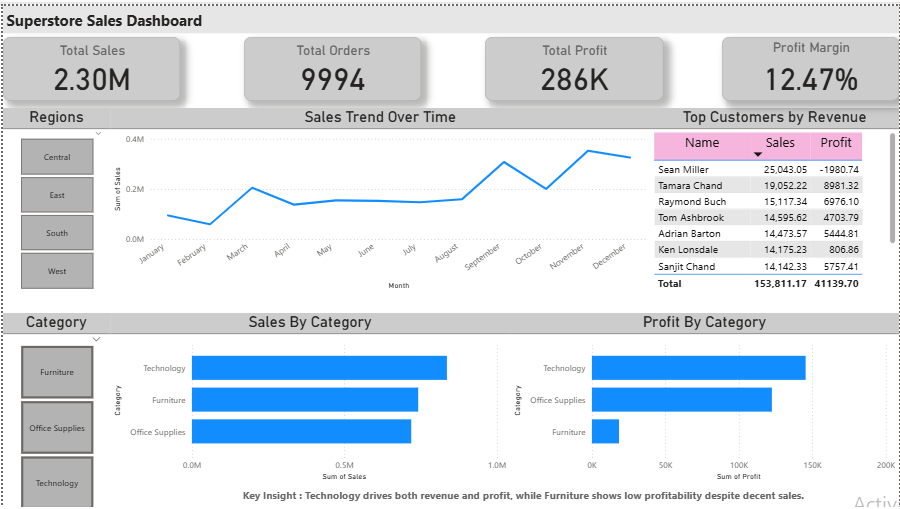

#  Superstore End-to-End Data Analysis Capstone

##  Project Overview

This project demonstrates a complete end-to-end data analysis workflow using SQL, Python, and Power BI on the Superstore retail dataset.

The goal of the project is to analyze sales performance, customer behavior, profitability trends, and business growth opportunities through data-driven insights and interactive visualizations.

---

#  Project Workflow

Raw Dataset (CSV)
↓
SQL Business Queries
↓
Python Data Cleaning & EDA
↓
RFM Customer Segmentation
↓
Processed Dataset
↓
Power BI Interactive Dashboard

---

#  Tools & Technologies Used

| Tool | Purpose |
|---|---|
| Python | Data cleaning, EDA, RFM analysis |
| Pandas | Data manipulation |
| Matplotlib / Seaborn | Data visualization |
| SQL (MySQL) | Business query analysis |
| Power BI | Interactive dashboard |
| Jupyter Notebook | Analysis environment |

---

#  Project Structure
```
superstore-capstone/

├── dashboard/
│   └── Superstore Dashboard.pbix
│
├── data/
│   ├── Sample - Superstore.csv
│   └── cleaned_data.csv
│
├── images/
│   └── dashboard.png
│
├── notebooks/
│   └── superstore_analysis.ipynb
│
├── sql/
│   └── superstore_analysis.sql
│
└── README.md
```
---

#  Dashboard Preview



---

#  Key Analyses Performed

##  Sales Trend Analysis
- Analyzed monthly and yearly sales patterns
- Identified seasonal fluctuations and growth trends

##  Category & Sub-Category Analysis
- Evaluated sales and profitability across categories
- Identified low-profit product segments

##  Customer Analysis
- Identified top-performing customers
- Analyzed repeat customer behavior

##  RFM Customer Segmentation

Customers were segmented based on:
- Recency
- Frequency
- Monetary Value

This helped identify:
- Loyal customers
- High-value customers
- Potential low-engagement customers

---

#  Key Business Insights

- Technology category generates the highest sales and profit.
- Furniture category shows lower profitability despite decent sales.
- Sales trends indicate seasonal demand fluctuations.
- A small percentage of customers contributes significantly to revenue.
- Profit margin suggests moderate business efficiency with room for optimization.

---

#  Power BI Dashboard Features

- KPI Cards (Sales, Orders, Profit, Profit Margin)
- Interactive slicers
- Monthly sales trend analysis
- Category-wise sales and profit analysis
- Top customers analysis
- Insight tooltip section

---

#  Business Objective

The objective of this project is to help businesses:
- Understand customer purchasing behavior
- Improve profitability
- Identify growth opportunities
- Make data-driven business decisions

---

#  Conclusion

This project demonstrates a practical end-to-end analytics workflow combining SQL, Python, and Power BI to transform raw retail sales data into meaningful business insights and interactive dashboards.

---

# Author

Shashwat Krishna

GitHub: https://github.com/srivshashwat8
